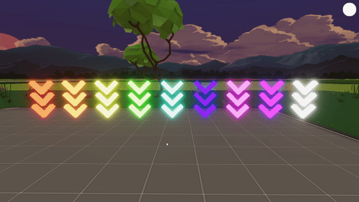

# Indicator Arrows

Colorful 3D arrows created by DOCTORdripp, for Decentraland and other metaverse use.

Improve the conversion optimization and user flow of your build by indicating key areas with these animated GLB files. Add a 15kb floating arrow to your build via SDK or Builder - these are completely ready to use. Available to download in 10 different colors and easy to edit to any color in Blender.

